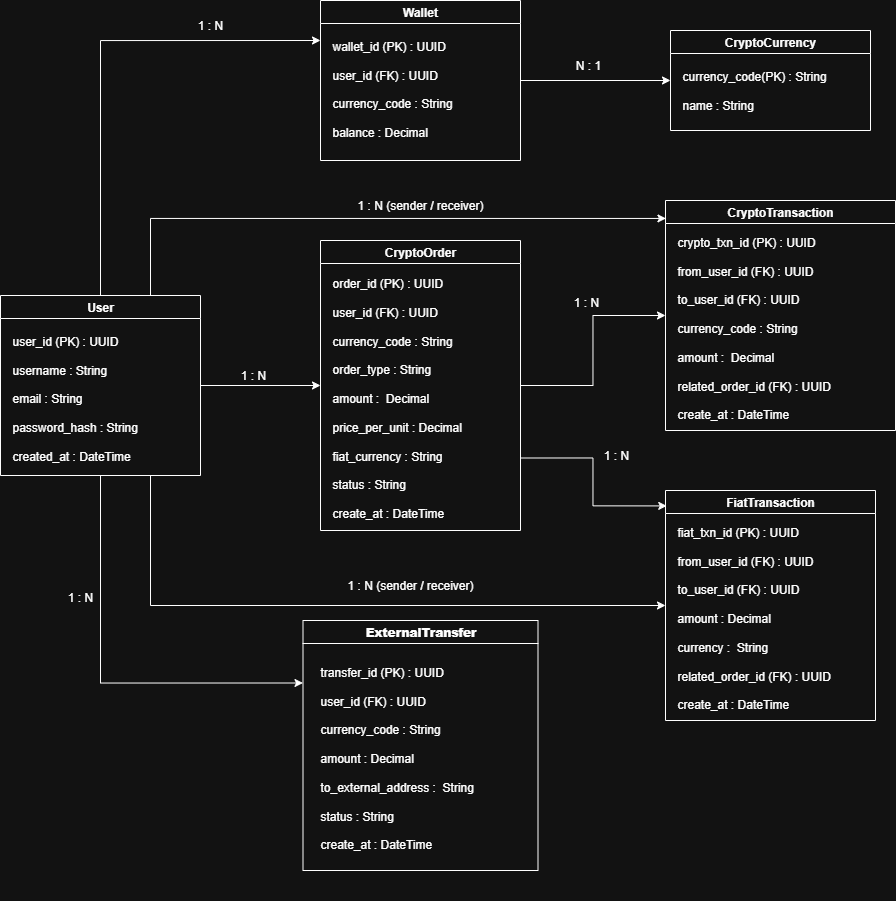

โจทย์ข้อ 1 ให้ออกแบบระบบฐานข้อมูล(ทำเป็นรูปแบบ ER) ที่เป็นตัวกลางของการแลกเปลี่ยน Cryptocurrencies เช่น Bitcoin โดย สามารถนำเงิน Fiat (THB,USD) มาซื้อเหรียญ จาก User คนอื่นๆในระบบได้ และสามารถจะโอนเหรียญหากันภายในระบบ หรือ โอนหาคนอื่นภายนอกระบบได้ 
ยกตัวอย่าง https://c2c.binance.com/th/trade/buy/BTC

- ระบบสามารถตั้ง ซื้อ-ขาย Cryptocurrencies (BTC,ETH,XRP, DOGE)
- ระบบบันทึกการโอนเงินและซื้อ-ขายแลกเปลี่ยน
- ระบบมีการสร้างบัญชีผู้ใช้

## ER Diagram



-----------------------------------------------------------------------------------------------------------------------------------------
โจทย์ข้อ 2 นำ ER Diagram จากข้อ 1 มาเขียนโดยใช้ Node.js หรือ PHP
เขียน Method ใน Model เพื่อดึงข้อมูลของ Model อื่นๆที่ความสัมพันธ์กัน ตัวอย่าง https://laravel.com/docs/8.x/eloquent-relationships#one-to-many
เขียน Controller และ Routing ในส่วนหลักๆของระบบ ไม่จำเป็นต้องทำทั้งหมด
สร้างไฟล์สำหรับ Seed ข้อมูล เพื่อใช้ในการทดสอบ


# Node.js + Express + Sequelize + SQLite Project

โปรเจกต์พัฒนา API ด้วย Node.js, Express, Sequelize และฐานข้อมูล SQLite  

---

## 🚀 Features

- ใช้งาน Sequelize ORM จัดการ Model และความสัมพันธ์แบบ One-to-Many  
- Seed ข้อมูลจำลองลงฐานข้อมูล SQLite อัตโนมัติ  
- RESTful API สำหรับดึงข้อมูลผู้ใช้พร้อมกระเป๋าเงิน  
- โครงสร้างโปรเจกต์แบบ MVC แยก Models, Controllers, Routes  

---

## 🛠️ TechStack

- Node.js v14+  
- Express.js  
- Sequelize ORM  
- SQLite  
- uuid (สำหรับสร้าง UUID)

---

## 💾 Installation & Setup
- ติดตั้ง [Node.js](https://nodejs.org/en/)
- ตรวจสอบ Node.js และ npm ในเครื่องด้วยคำสั่ง:
  ```bash
  node -v
  npm -v


-----------------------------------------------------------------------------------------------------------------------------------------
***************** ขั้นตอน Run project *****************
-----------------------------------------------------------------------------------------------------------------------------------------
1. ติดตั้ง Dependencies
    command > npm install

2. Seed ข้อมูลจำลองลงฐานข้อมูล
    command > node seeders/seed.js

3. รันเซิร์ฟเวอร์
    command > node app.js

4. ทดสอบ API
    เปิดเว็บเบราว์เซอร์หรือใช้โปรแกรม Postman / Insomnia ทดสอบ GET API

    URL: http://localhost:3333/api/users

    Method: GET

คำแนะนำ
#หากต้องการตรวจสอบภายใน Project ทันที ให้ Seed ข้อมูลก่อนและจะแสดงในรูปแบบ JSON ได้เลยครับ